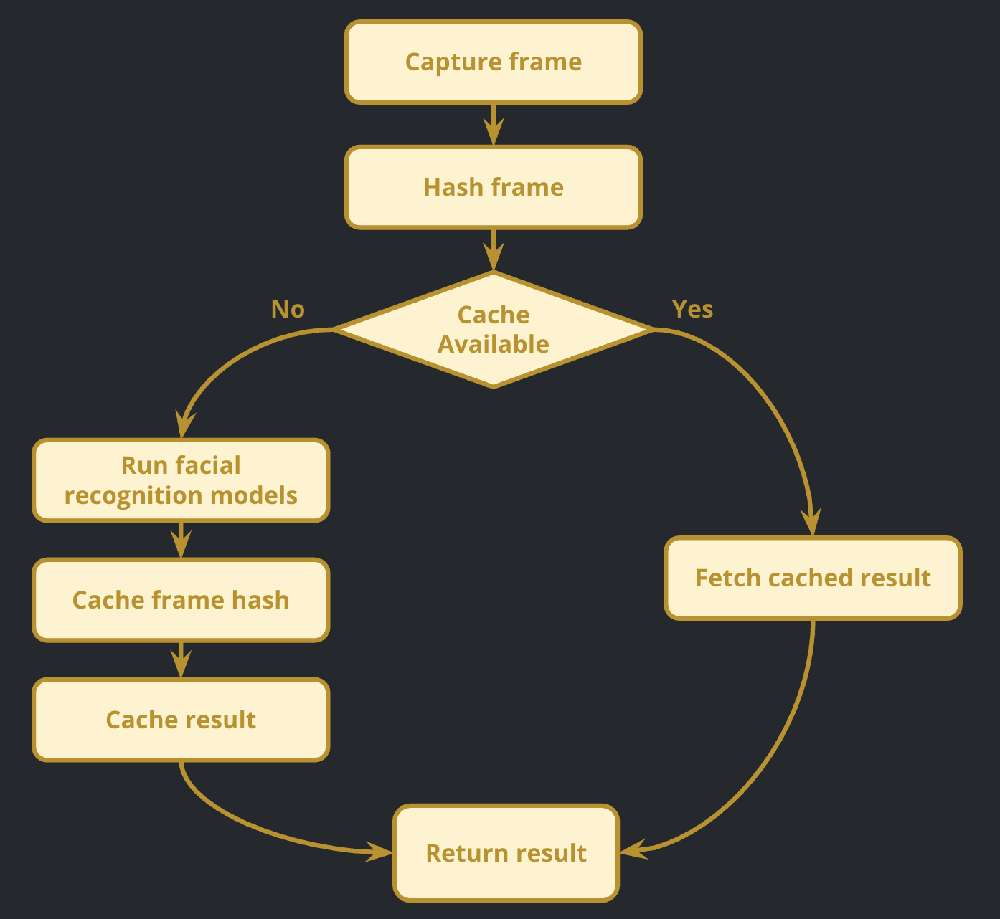
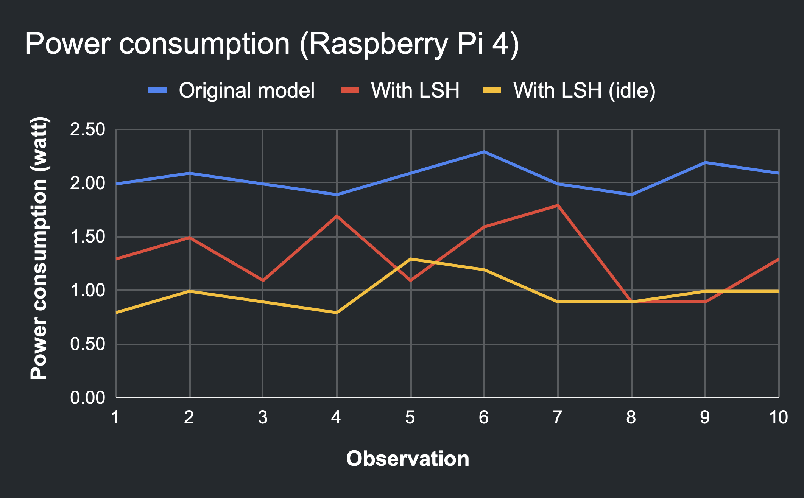

# LSH Facial Recognition

This project implements an energy-efficient facial recognition system utilizing Locality Sensitive Hashing (LSH). It is designed to run effectively on low-powered devices like the Raspberry Pi 4 by minimizing expensive deep learning inference calls.

## Overview

Traditional facial recognition using deep learning can be computationally expensive, especially on low-powered devices. This project utilizes LSH to identify similar frames in consecutive frames and avoid running the full recognition pipeline.

**How it works:**
1.  **Frame Hashing**: Each incoming video frame is hashed using Locality Sensitive Hashing (LSH).
2.  **Similarity Check**: The current frame's hash is compared to the previous frame's hash using Locality Sensitive Hashing (LSH) techniques.
3.  **Cache Decision**:
    -   If the the frame is similar to the previous frame (hash similarity > threshold), the system reuses the previously detected faces and names.
    -   Else, the system runs the full, expensive face detection and recognition pipeline.



This approach significantly reduces power consumption on resource-constrained devices like the Raspberry Pi 4.

### Experimental Results


On average, it can reduce up to 44% during general usage and up to 71% when idle.

## Prerequisites

-   Python 3.x
-   Webcam (USB or PiCamera)

### Dependencies

Install the required packages using pip:

```bash
pip install -r requirements.txt
```

*Note: installing `face_recognition` and `dlib` on Raspberry Pi may require additional system dependencies (cmake, etc.).*

## Project Structure

-   `headshots.py`: Script to capture training images for a new person.
-   `train_model.py`: Trains the facial recognition model on captured images and saves encodings to `encodings.pickle`.
-   `lsh_facial_req.py`: The main script that runs real-time facial recognition using LSH.
-   `dataset/`: Directory storing face images (organized by folders named after the person).
-   `encodings.pickle`: Serialized file containing face encodings and names.

## Usage

### 1. Data Collection

To add a new person to the recognition database:

1.  Open `headshots.py`.
2.  Edit the `name` variable to the person's name (e.g., `name = 'Emily'`).
3.  Run the script:
    ```bash
    python headshots.py
    ```
4.  Press **SPACE** to take photos (aim for 10-20 varied angles).
5.  Press **ESC** to exit.

### 2. Training the Model

After collecting data, process the images to create matched embeddings:

```bash
python train_model.py
```

This will generate (or update) `encodings.pickle`.

### 3. Running Recognition

Start the main recognition program:

```bash
python lsh_facial_req.py
```

-   The system will startup the camera.
-   Press **'q'** to quit.

## Configuration

In `lsh_facial_req.py`, you can adjust the sensitivity:
-   `similarity < 0.95`: The threshold for re-running recognition. Lower means strictly different scenes trigger recognition; higher means even slight changes trigger it.

## Hardware

Tested on:
-   MacBook Pro (Webcam)
-   Raspberry Pi 4 (USB Webcam / PiCamera)
